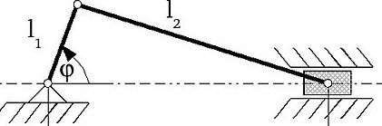

---
"layout": "page",
"title": "mec2-getting-started",
"header": "Getting Started",
"date": "2020-06-09",
"description": "",
"permalink": "#",
"tags": []
---

### What is mec2?

`mec2` is a physics engine, which purpose is to simulate the movement of two dimensional mechanical linkages.
It has a new concept of treating elements as particles whose movements follow constraints.

`mec2` has no dependencies for the simulation and implements all necessary infrastructure on its own.
For rendering the model the graphics library `g2` is used.
To read more about `g2` have a look [here](github.com/goessner/g2).
Models are described using the human and machine readable `JSON` format.

### what can we draw with it?

to draw and simulate Model of mechanismus like these hier.



<mec-2 width="400" height="300" grid cartesian>
        {
            "nodes": [
                { "id": "A0", "x": 75, "y": 125, "base": true },
                { "id": "A", "x": 100, "y": 175 },
                { "id": "B0", "x": 300, "y": 125 }
            ],
            "constraints": [
                {
                  "id": "a", "p1": "A0", "p2": "A",
                  "len": { "type": "const" },
                  "ori": { "type": "drive", "repeat": 3 }
                }, {
                  "id": "b", "p1": "B0", "p2": "A",
                  "len": { "type": "const" }
                }, {
                  "id": "c", "p1": "A0", "p2": "B0",
                  "ori": { "type": "const" }
                }
            ],
            "shapes": [
                { "type": "fix", "p": "A0" },
                { "type": "flt", "p": "B0" }
            ]
        }
 </mec-2>
        <script src="bin/g2.js"></script>
        <script src="bin/g2.selector.js"></script>
        <script src="bin/canvasInteractor.js"></script>
        <script src="bin/mec2.min.js"></script>
        <script src="bin/mec.htmlelement.js"></script>


<mec-2 width="401" height="301" grid cartesian x0="100" y0="125">
{   "nodes":[
    {"id":"A0","x":0,"y":0,"base":true},
    {"id":"A", "x":0,"y":50},
    {"id":"B", "x":170,"y":120},
    {"id":"B0","x":200,"y":0,"base":true}
],
"constraints":[
    {"id":"a","p1":"A0","p2":"A","len":{"type":"const"},"ori":{"type":"drive","repeat":5}},
    {"id":"b","p1":"A","p2":"B","len":{"type":"const"}},
    {"id":"c","p1":"B0","p2":"B","len":{"type":"const"}}
]
}
</mec-2>
<script src="mec2/bin/canvasInteractor.js"></script>
<script src="mec2/bin/g2.js"></script>
<script src="mec2/bin/g2.selector.js"></script>
<script src="mec2/mec2.js"></script>
<script src="mec2/bin/mec.htmlelement.js"></script>

### Which Knowlge are important to start with mec2?

A `mec2` model can consist of up to 9 different modules.
<!-- TODO: Make all of these elements links -->
Some of them are absolutely necessary and to omit them most likely results in an inapt model:
 - [Core](#core)
 - [Model](#model)
 - [Nodes](#nodes)
 - [Constraints](#constraints)

Other modules provide extra functionality and may be included as needed:
 - [Load](#load)
 - [Drive](#drive)
 - [View](#view)
 - [Shape](#shape)
 - [Messages](#messages)

They are included by the casual `<script src="..."></script>` syntax and can be included or omitted as needed.
Alternatively the embedded `mec-2` HTML custom element can be used.

To render models the graphics library `g2` is used, which is not only recommended, but also integrated into `mec2` in various ways.
Therefore it is advised to import it as well.

<!-- TODO Create unified import... -->
Please note that for the current usage of the custom HTML Element additional files have to be imported.

The custom HTML element provides interactive features to the model.

---
Let's go through the process of creating this mechanism step by step.

At first `g2` and `mec2` are imported:
```html
<script src="../../g2/src/g2.js"></script>
<script src="../../mec2/mec2.min.js"></script>
```

Both consist of different modules, which can be further inspected by looking at the respective wikis.
Please note that `mec2.min` is a combination of all (currently) existing mec2 modules.
If there is no need for minimalism, this is a valid shortcut to include everything mec2 has to offer.

At this point we already can begin with the definition of our model:

The model can be composed of different properties based on the respective
modules. In this very case of `nodes`, `constraints` and `views`.

### Nodes

`nodes` can be seen as particles.
They do not have any boundaries on their own, but properties which determine their state.
As you can see they are described solely by their coordinates.
The `id` is, hence the name, an identifier for later processing.
```json
"nodes": [
    { "id": "A0", "x": 75, "y": 100, "base": true },
    { "id": "A", "x": 75, "y": 150 },
    { "id": "B", "x": 275, "y": 220 },
    { "id": "B0", "x": 275, "y": 100, "base": true },
    { "id": "C", "x": 125, "y": 225 }
],
```
The `base` flag is used to determine if the `node` is fixed (treating the particle as if it has infinite mass).`

### Constraints

`contraints` are used to define correlation between different `nodes`.
Although `nodes` are not bound on their own, `contraints` change that by constraining them to set conditions.

```JSON
"constraints": [
    { "id": "a", "p1": "A0", "p2": "A", "len": { "type": "const" },
        "ori": { "type": "drive", "Dt": 2, "Dw": 2*Math.PI }
    },
    { "id": "b", "p1": "A", "p2": "B", "len": { "type": "const" } },
    { "id": "c", "p1": "B0", "p2": "B", "len": { "type": "const" } },
    { "id": "d", "p1": "B", "p2": "C", "len": { "type": "const" }, "ori": { "ref": "b", "type": "const" } }
],
```

`constraints` are defined by using the `ids` of two `nodes`, using them as property `p1` and `p2` respectively.

`constraints` can change the relation of either the distance of two particles, or the orientation.
By settings `"len": { "type": "const" }` the distance between two `nodes` is fixed and only the orientation of them can be changed (resulting in one of the two particles orbiting around the other).
Respectively by setting `"ori": {"type": "const"}` the orientation is fixed and only a translational shifting is possible.
By setting both `types` to `const` the two particles are "fixed".

By setting the type to `drive` one can determine the behavior of two `nodes` to one another over time, thus simulating a driven motion.
For this the `mec.drive` module has to be imported (incidentally done by `mec2.min.js`).

Likewise `nodes`, `constraints` have `ids` to identify them later on for further processing.

By setting `nodes` and `constraints` a fully working mechanism is defined and can already be analyzed.

### Views

To support the user with some analysis options `views` can be used, brought by the `mec.views` module.

```JSON
"views": [
    { "show": "pos", "of": "C", "as": "trace", "Dt":2.1, "mode":"preview", "fill":"orange" },
    { "show": "vel", "of": "C", "as": "vector" },
    { "as": "chart", "x": 350, "y": 150, "Dt": 1.9, "t0": 0.1,
    "xaxis": {"show": "w", "of": "a"},
    "yaxis": [
        {"show": "wt", "of": "d"},
        {"show": "wt", "of": "c"}
    ],
}]
```

`views` offers different options to choose from to make features visible.
These different options share a lot of properties, which are:
- `show`: which is a mapping to the different properties which can be shown here. (position, velocity, acceleration, momentum, force...)
 - `of`: is the `id` which should be singled out to determine the property which is to visualize. Needless to say the user has to take care that the respective element with this `id` has to have the property defined by `show`.
 - `as`: determines the `view` which is to be used. In this example `trace`, `vector` and `chart` are represented, but there are others to choose from.
 - `t0`: defines when to start the recording (referring to the model timer).
 - `Dt`: defines the duration of the recording after `t0`.

To further read about the different `views` and possible properties to choose from please should have a look to the [respective wiki](../wiki/views).

### Model rendering

Please note that the following steps are automatically executed if the model is implemented using the `<mec-2>` element.

At first the functionality offered by the `mec` object has to be applied to our `model` object, thus extending it with all the functionality it needs.
This is done by issuing: `mec.model.extend(model);`

After doing that, we have to initialize all the properties of the `model` which were defined earlier on: `model.init()` is doing that for the whole model.

The rest of the code is responsible for the rendering of the model:
```js
const g = g2().del().clr().view({ cartesian: true });
model.draw(g);
(function render() {
    model.tick(1/60);
    g.exe(ctx);
    requestAnimationFrame(render)
})();
```

`model.draw(g)` applies the model to a `g2` command queue which is then rendered onto the canvas in the defined context at the top of the code.

Inside the `render` queue the `model.timer` is advanced one sixtieth of a second each iteration by calling `model.tick(1/60)`.
Assuming a 60hz Monitor is used (or at least requestAnimationFrame operates in 60hz) this results in a convenient mapping to real time.

If you want to know more about `g2` feel free to check out [g2's GitHub page](github.com/goessner/g2).
